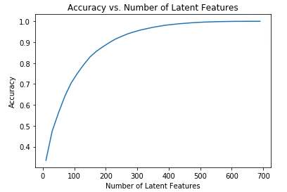
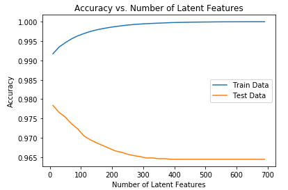

# Recommendations_with_IBM_Watson_Studio

### Table of Contents

1. [Installation](#installation)
2. [Project Motivation](#motivation)
3. [Program Execution](#files)
4. [Results](#results)
5. [Acknowledgements](#Acknowledgements)

## Installation 
- This project was built using Anaconda version 1.9.12 and Python  3.6.    

- Libraries used:

   - Machine Learning: `sklearn` `pandas` `numpy`  
   - Model Saving and Loading: `pickle`
   - Web App and Data Visualization: `matplotlib` `seaborn`

## Project Motivation

This project is to look at the interactions that users have with articles on the IBM Watson Studio platform.

The recommender system can make recommendations in a number of ways:
1. Rank Based Recommendations
> - To get started in building recommendations, first find the most popular articles simply based on the most interactions. Since there are no ratings for any of the articles, it is easy to assume the articles with the most interactions are the most popular. These are then the articles we might recommend to new users (or anyone depending on what we know about them).
2. User-User Based Collaborative Filtering
> - In order to build better recommendations for the users of IBM's platform, we look at users that are similar in terms of the items they have interacted with. These items could then be recommended to the similar users. This would be a step in the right direction towards more personal recommendations for the users. 
3. Matrix Factorization
> - Finally, we complete a machine learning approach to building recommendations. Using the user-item interactions, build out a matrix decomposition. Using decomposition, get an idea of how well we can predict new articles an individual might interact with. 

## Program Execution 

You can run the Juypter notebook file as attached

## Results

The site can be accessed when [demo server](http://maxcn.asuscomm.com:3001) started 

## Licensing, Authors, Acknowledgements
Thanks to [IBM Watson Studio](https://dataplatform.cloud.ibm.com/) for the data and [Udacity](https://www.udacity.com/) provided this topic. 
